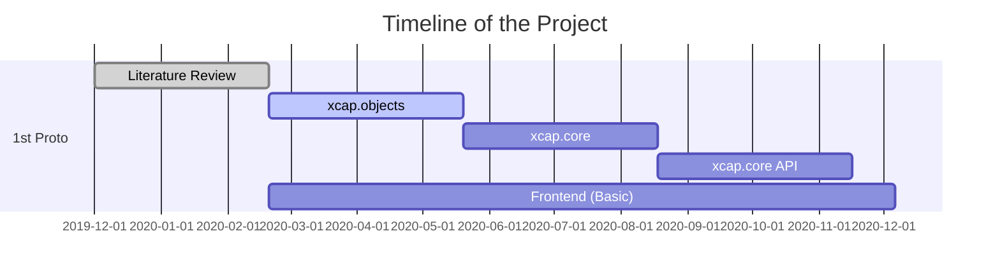

# Introduction
$$
\Rho(x,y,x) = \frac{1}{V} \sum_{-h}^h\sum_{-k}^k\sum_{-l}^l F_{hkl} .\exp[-2\pi i(hx + ky + lz - \alpha_{hkl})]
$$
*Almost all aspects of life are engineered at the molecular level, and without understanding molecules we can only have a sketchy understanding of life itself. - *Francis Crick**

**X**ray **C**rystallography and **A**nalytics **P**ipeline, **XCAP** is a project to reimagine the crystallography tools in a modern, state of the art computer world. We are a group of software developers working continuously with crystallographers, biochemists and research scientists to architect, write and build an automation pipeline taking advantage of modern concepts like containerization, microservices, graph APIs with the philosophy of DevSecOps in the core.
On the first phase, the primary objective of the project is to collect, link and bridge different crystallography tools that are available under a single framework to provide easier usability by developing simpler user interfaces and CLI tools, better security by implementing industry-standard protocols, expandability and scalability by opening up standard APIs.

# Project Status

 # Technology Used
 
|  |  |
|--|--|
 | Backend | Go |
 | Frontend | React.js |
 | Containerizaton (Microservices) | Docker |
 | Containerizaton (Wrapper) | LXC/LXD |
 | Developement Pipeline | Chef, InSpec |
 | API | GraphQL |
 | MessageQ | RabbitMQ |
 | Database | MySQL, Mongo |
 | Supported Auth | DB Connectores, LDAP, SSO |
 | Storage Backend | ZFS (Preffered), NFS |
 | Targeted OS | UNIX Like |
 | Wrappers | HKL, CCP4, Phenix and more|
  
  > **Note:** The project does NOT distribute binaries of HKL, CCP4, Phenix or any other tools that are/might be required to run parts of the project. These tools must be installed by the user/administrator on a system as per their license agreement and citation requirements specified on their respective website. Once installed, the tools can be linked to the framework by a config file. 
